import AuthorList from "../../src/components/Author";

# MODUL 1: Class, Enumeration, Interface

<AuthorList authorsName={["yasmin"]} />

## **Java**  
###  **Java Basics**  
   Java adalah *object-oriented programming language* yang dibuat pada tahun 1995\. Java merupakan *programming language* yang popular karena Java dapat mudah digunakan di *platform* manapun yang *support* Java. Java sering digunakan dalam pembuatan atau pengembangan aplikasi *mobile*, *games*, dan *web server*. Bahasa Java memiliki beberapa kelebihan yang membuatnya sebagai bahasa program yang populer, berikut adalah beberapa kelebihan yang dimiliki Java:  
* Platform Independence  
  Salah satu kelebihan bahasa Java adalah kemampuannya untuk digunakan dan dijalankan pada *platform* yang berbeda-beda. *Code* dalam bahasa Java akan di-*compile* menjadi *bytecode* yang dapat dijalankan pada *device* apapun yang memiliki Java Virtual Machine (JVM)  
* Multithreading  
  Java *support* penggunaan *multithreading* *programming*. Program Java dapat mengubah *task* yang besar menjadi beberapa *threads* berbeda yang dijalankan secara bersamaan. *Multithreading* pada Java ini dapat digunakan pada aplikasi berat yang perlu meng-*handle* banyak task di waktu bersamaan tanpa memperlambat *system*.   
* Security yang tinggi  
  Java memiliki tingkat *security* yang tinggi karena beberapa hal, seperti melakukan pemeriksaan program saat di-*compile*, program Java dijalankan di dalam *virtual* *machine sandbox*, tidak menggunakan *explicit pointer* yang membuat *user* tidak bisa mengakses *memory* secara langsung dari *code* Java, dan Java juga mengisolasi *code* yang di-*load* *external*.   
* Object oriented dan Library yang luas  
  Keunggulan dari OOP adalah adanya beberapa konsep seperti *class, object, inheritance, encapsulation, polymorphism*, dan *abstraction* yang dapat digunakan untuk mengatur penggunaan *code* atau fungsi pada *object* tertentu, membatasi akses atau penggunaan fungsi untuk mencegah terjadinya *error*, dan penggunaan kembali *code* yang sudah dibuat.    
    
  Bahasa Java juga cocok digunakan pada beberapa hal, seperti:  
* Web Application.   
  Java dapat digunakan dalam *web* *application* karena Java memiliki beberapa teknologi seperti JSP dan Servlet yang digunakan untuk *develop* dan *deploy* *web* *application*. Java juga menyediakan *framework* seperti Spring yang dapat membantu pengembangan *web application*.   
* Game development  
  Java bisa menjadi bahasa yang cocok digunakan untuk *game* *development* bagi orang-orang yang ingin memulai *game* *development*, karena Java memiliki *tools* dan *framework* yang luas. Beberapa *game* *engine* yang menggunakan Java untuk *game* *development* yaitu LibGDX dan jMonkeyEngine.  
    
### **Tipe Data**   
   Sama seperti bahasa program lain, Java juga memiliki tipe data. Tipe data pada Java dibagi menjadi 2, yaitu *primitive* dan *non-primitive*:  
* Primitive  
  Tipe data *primitive* adalah tipe data yang menyimpan *single* *value* saja. Berikut adalah 8 tipe data *primitive* pada Java:

| Data Type | Size | Description |
| :---- | :---- | ----- |
| byte | 1 byte | Stores whole numbers from \-128 to 127 |
| short | 2 bytes | Stores whole numbers from \-32,768 to 32,767 |
| int | 4 bytes | Stores whole numbers from \-2,147,483,648 to 2,147,483,647 |
| long | 8 bytes | Stores whole numbers from \-9,223,372,036,854,775,808 to 9,223,372,036,854,775,807 |
| float | 4 bytes | Stores fractional numbers. Sufficient for storing 6 to 7 decimal digits |
| double | 8 bytes | Stores fractional numbers. Sufficient for storing 15 decimal digits |
| boolean | 1 bit | Stores true or false values |
| char | 2 bytes | Stores a single character/letter or ASCII values |

* Non-primitive  
  Tipe data *non*\-*primitive* adalah tipe data yang menyimpan data yang lebih kompleks dan merujuk ke *object* tertentu. Contoh dari tipe data *non-primitive* adalah String, class, interface, array, linked list, dan lain-lain.  
    
  Perbedaan tipe data *primitive* dan *non*\-*primitive*:

| Primitive | Non-primitive |
| ----- | ----- |
| Tipe data *primitive* harus memiliki *value* | Tipe data *non-primitive* bisa *null* |
| TIpe data *primitive* hanya bisa menyimpan *single* *value* | Tipe data *non-primitive* bisa menyimpan lebih dari 1 *value* |
| Penamaan dimulai dari huruf kecil (*lowercase*) | Penamaan dimulai dari huruf kapital (*uppercase*) |

### **Arithmetic Operator**

| Operator Type | Symbol | Example | Description |
| :---- | ----- | ----- | ----- |
| **Addition** | \+ | *a \+ b* | Adds two operands |
| **Subtraction** | \- | *a \- b* | Subtracts the second operand from the first |
| **Multiplication** | \* | *a \* b* | Multiplies two operands |
| **Division** | / | *a / b* | Divides the first operand by the second |
| **Modulus** | % | *a % b* | Returns the remainder of the division |

###  **Logic Operator**

| Operator | Example | Meaning |
| :---: | ----- | :---: |
| && (Logical AND) | expression1 **&&** expression2 | **True** only if both *expression1* and *expression2* are **true** |
| || (Logical OR) | expression1 **||** expression2 | **True** if either *expression1* or *expression2* is **true** |
| \! (Logical NOT) | **\!**expression | **True** if *expression* is **false** and vice versa |

### **Comparator**

| Operator | Description | Example |
| :---: | :---: | :---: |
| \== | Is Equal To | 3 \== 5 returns **false** |
| \!= | Not Equal To | 3 \!= 5 returns **true** |
| \> | Greater Than | 3 \> 5 returns **false** |
| \< | Less Than | 3 \< 5 returns **true** |
| \>= | Greater Than or Equal To | 3 \>= 5 returns **false** |
| \<= | Less Than or Equal To | 3 \<= 5 returns **true** |

### **Conditional Statement**  
1. If statement  
   Block code di dalam *if statement* akan dijalankan jika *condition* bernilai *true*.  
   Contoh:  
   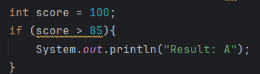
     
2. Else if statement  
   *Else if statement* akan dijalankan jika *condition* pada *statement* sebelumnya *false* dan *condition* dalam *else if* bernilai *true*.  
     
     
   Contoh:   
   !  
     
3. Else statement  
   *Block code* di dalam *else* *statement* akan dijalankan jika seluruh *condition* pada *if* atau *else* *if* sebelumnya bernilai *false*.  
   Contoh:  
   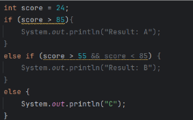  
     
     
4. Short hand if-else  
   *Short hand if-else* sama seperti *if-else statement*, hanya saja *statement* ini dapat dibuat hanya dalam satu baris saja. *Syntax* dari *short hand if-else* adalah:  
   **Variable \= (condition) ? expressionTrue : expresionFalse**  
   Contoh:  
   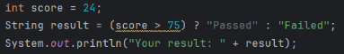
     
   Code di atas memiliki tujuan yang sama dengan code di bawah:  
   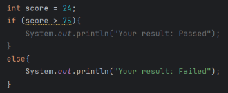  
5. Switch-case  
   *Switch-case statement* memiliki tujuan yang sama dengan *if-else statement. Switch-case* bisa digunakan jika terlalu banyak *if-else statement* yang digunakan.  
   Contoh: 
   ```java 
   int month \= 2;  
          switch (month){  
              case 1:  
                  System.out.println("January");  
                  break;  
     
              case 2:  
                  System.out.println("February");  
                  break;  
     
              case 3:  
                  System.out.println("March");  
                  break;  
     
              case 4:  
                  System.out.println("April");  
                  break;  
     
              default:  
                  System.out.println("Others");  
          }  
   ```
     
     
### **Looping**   
1. For loop  
   *Block code* di dalam *for loop* akan dijalankan berdasarkan *initialization condition, condition,* dan *increment/decrement* yang digunakan.   
   Contoh *code*:  
   ```java
   for (int i \= 0; i \< 5; i++){  
       System.*out*.println("Looping " \+ (i \+ 1));  
   }  
   ```
      
   Output:  
   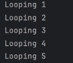

2. While loop  
   *Block code* di dalam *while* *loop* akan dijalankan jika Boolean *condition* di dalam while bernilai *true*.   
     
   Contoh *code*:  
   ```java
   int i \= 0;  
   while (i \< 10){  
    System.*out*.println("While loop " \+ (i+1));  
    i++;  
    }
    ```

   Output:

   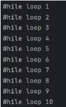

   

3. Do while loop  
   *Block code* di dalam *do while loop* akan dijalankan sekali terlebih dahulu, dan akan dijalankan kembali jika Boolean *condition* di dalam *while* bernilai *true*.  
   Contoh code:  
   ```java
   int i \= 0;  
   do {  
       System.*out*.println("Do while loop " \+ (i+1));  
       i++;  
   }  
   while (i \< 7);  
   ```
     
   Output:  
   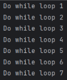 
 

### **Class**  
   *Class* pada Java merupakan kumpulan dari *objects* yang memiliki atribut yang sama, *class* bisa juga disebut sebagai *blueprint* dalam membuat sebuah *object*. *Object* pada Java adalah *real-life entities* yang dibuat untuk menggunakan atribut yang ada pada suatu *class*.   
   Untuk mempermudah dalam memahami *class* dan *object*, bayangkan seorang arsitektur memiliki *blueprint* yang berisi mengenai rancangan bangunan yang dibangun, dan terdapat gedung-gedung yang dibangun berdasarkan blueprint tersebut. Dalam contoh ini, *blueprint* bangunan adalah *class* dan gedung-gedung yang dibangun menggunakan *blueprint* tersebut adalah *object*.   
     
   Berikut adalah beberapa komponen yang ada di dalam *class*:  
1. Variable/field  
   *Variable* atau *field* digunakan untuk menyimpan *value* dari suatu *object* yang menggunakan suatu *class*. Ibaratkan pada *blueprint* bangunan, terdapat informasi seperti warna apa yang akan digunakan untuk membangun suatu gedung, berapa banyak pintu atau jendela yang ingin dimiliki oleh gedung tersebut, dan lain-lain.   
2. Method/function  
   *Method* atau *function* merupakan kumpulan *code* yang akan dijalankan jika dipanggil. *Method* dapat dipanggil menggunakan *parameter* atau tidak. *Method* atau *function* dapat diibaratkan seperti pekerja konstruksi yang membangun gedung tersebut.   
3. Constructor  
   *Constructor* merupakan *method* atau *function* akan dijalankan pertama kali secara otomatis setiap sebuah *object* menggunakan *class* tersebut. Umumnya *constructor* berisi *code* untuk menyimpan *input* *user* ke *variable* yang ada di *class* tersebut. *Constructor* dapat diibaratkan saat menyiapkan bahan-bahan untuk membangun gedung, seperti menyiapkan pintu dan jendela sesuai dengan jumlah yang diminta.   
4. Nested class  
   *Nested* *class* merupakan *class* yang ada di dalam *class*. *Nested* *class* ini dapat diibaratkan seperti pada *blueprint* bangunan, terdapat *blueprint* juga untuk membangun ruangan berbeda pada bangunan tersebut.   
   Selain itu, terdapat beberapa hal yang perlu diketahui saat membuat *class* pada Java:  
1. Access modifiers  
   *Access* *modifiers* mengatur bagaimana suatu *class* atau *variable* diakses oleh *object*. Terdapat 3 tipe *access* *modifier*:  
* Public

  *Class, method*, atau *field* yang menggunakan *public* dapat diakses dari manapun dan siapapun. 

* Private

  *Method* atau *field* yang menggunakan *private* hanya bisa diakses di dalam *class* tempat *method* atau *field* dibuat. 

* Protected

  *Method* atau *field* yang menggunakan *protected* hanya bisa diakses oleh *class* yang berada di dalam *package* yang sama atau *subclass* yang berasal dari *package* berbeda. 


2. Tipe class  
* Final Class

  *Final* *class* pada Java menandakan bahwa isi dari *class* tersebut tidak bisa berubah dan akan tetap sama selama program berjalan. 

* Static Class

  *Class* yang dapat menggunakan tipe *static* ini adalah class yang hanya berupa *nested* *class*. *Static* *class* dapat digunakan untuk me-*manage* penggunaan *memory* agar lebih efisien, karena *instance* dari suatu *class* tidak perlu dibuat. Komponen yang ada di dalam *static* *class* juga harus bertipe *static*, komponen *static* ini tidak bisa mengakses komponen *non*\-*static* yang berada di *outer* *class*. 

* Abstract Class

  *Abstract* *class* adalah *class* yang menggunakan *keyword* *abstract* dan dapat memiliki atau tidak memiliki *abstract* *method*. *Abstract* *method* adalah *method* yang tidak memiliki isi. Tujuan dari *abstract* *class* adalah agar *abstract* *method* yang berada di dalamnya dapat digunakan oleh *subclass* dari *abstract* *class* tersebut. Pada *subclass* tersebut, *abstract* *method* dapat diisi dengan code yang berbeda-beda sesuai dengan tujuannya. 


3. Method main  
   Dalam membuat *class*, *method* *main* merupakan *method* yang perannya sangat penting. *Method* *main* merupakan *method* yang menjadi titik awal dimana JVM akan menjalankan atau mengeksekusi program Java yang dibuat. Dalam kata lain, *code* yang berada di *method* *main* adalah *code* yang akan dijalankan oleh program. Program Java tidak akan bisa dijalankan jika tidak memiliki *method* *main*. *Method* *main* memiliki *syntax* seperti berikut:
   ```java
   public static void main(String args\[\])  
   ```
     
   Berikut adalah langkah-langkah membuat *class* dan *object* pada Java:  
1. Penamaan Class.  
   Pada pemrograman Java, terdapat beberapa syarat penamaan *class* yang harus dipenuhi. Yang pertama adalah nama file Java harus sama dengan nama *class* pertamanya, dan perlu diingat bahwa Java adalah bahasa program yang *case*\-*sensitive*. Yang kedua adalah penamaan *class* pada Java diawali dengan huruf kapital. Berikut contoh penamaan class Java yang benar:  
   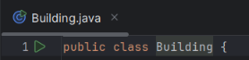

     
2. Pembuatan Variable  
   Pembuatan *variable* pada Java diawali dengan menuliskan tipe data yang digunakan dan dilanjutkan dengan nama *variable* yang diinginkan. Berikut contoh pembuatan *variable*:  
   ```java
   int floor, windows, door;  
   String colour;
   ```  
     
3. Pembuatan Method  
   Pembuatan *method* pada Java dapat dilakukan seperti berikut:  
   **\[Modifier\] \[Return\_Type\] \[Method\_Name\](\[Parameters\])**  
   Berikut contohnya:  
   ```java
   public void makeRoom(int inputFloor, String colour)
   ```
   

   *Code* di atas merupakan contoh pembuatan *method* bernama makeRoom. *Public* merupakan *access* *modifier* yang menandakan bahwa *method* tersebut bisa digunakan dimanapun, *return* *type* yang digunakan adalah *void* yang berarti tidak ada *value* yang dikembalikan dari *method* tersebut, makeRoom adalah nama dari *method*, dan inputFloor serta colour merupakan parameter yang digunakan oleh *method* tersebut. 

     
4. Pembuatan Constructor  
   Dalam membuat *constructor* suatu *class*, nama dari *constructor* harus sama persis dengan nama *class* tersebut. *Constructor* dapat memiliki *parameter* atau tidak. Berikut adalah contoh pembuatan *constructor* pada *class* Building:
   ```java
   Building (int inputFloor, int inputWindows, int inputDoor, String inputColour){  
       this.floor \= inputFloor;  
       this.windows \= inputWindows;  
       this.door \= inputDoor;  
       this.colour \= inputColour;  
   }  
   ```
     
   Dari *code* tersebut, *constructor* Building memiliki 5 buah parameter. *Constructor* tersebut bertujuan untuk menyimpan data yang di-*input* oleh *user* saat membuat *object* ke dalam *variable* dari *class* tersebut. *Variable* yang menggunakan “this” menunjukkan bahwa *variable* tersebut merupakan *variable* yang dideklarasikan di dalam class tersebut. 

     
5. Pembuatan Object  
   Pembuatan *object* dapat dilakukan dengan seperti berikut:  
   **\[Class\_Name\] \[Object\_Name\] \= new \[Constructor\_Class()\]**  
     
   Berikut contohnya  
   ```java
   Building buildingA \= new Building (3, 4, 2, "White");
   ```
   

   *Code* tersebut merupakan *code* yang bertujuan untuk membuat *object* bernama **buildingA** yang menggunakan *class* **Building**. Untuk memudahkan dalam memahami bagian ini, bayangkan Anda membuat sebuah gedung bernama buildingA menggunakan blueprint yang bernama Building. Dalam membangun gedung buildingA, Anda meminta kepada arsitek bahwa Anda ingin memiliki gedung 3 lantai, 4 buah jendela, 2 buah pintu, dan berwarna putih. 

     
     
6. Menggunakan Method melalui Object  
   Misalkan di dalam *class* Building terdapat *method* bernama makeBuilding seperti berikut:  
   ```java
   void makeBuilding(){  
    System.*out*.println("\\nThe building is finished\!\! Building details: \\nColour: " \+ colour \+ "\\nFloor: "\+ floor \+ "\\nDoor: "\+door\+"\\nWindow: "\+windows);  
   }
   ```
   

   *Method* tersebut dapat digunakan melalui *object* yang menggunakan *class* Building. Berikut adalah contohmya:  
   **\[Object\_Name\].\[Method\_name()\];**  
   ```java
   buildingA.makeBuilding();  
   ```

   *Code* di atas menunjukkan bahwa *object* buildingA memanggil *method* makeBuilding(), sehingga *method* tersebut dijalankan oleh program.   
     
   Dan berikut adalah keseluruhan *code* dari pembuatan *class* Building:  
   ```java
   public class Building {  
       //Variable  
       int floor, windows, door;  
       String colour;

       //Constructor  
       Building (int inputFloor, int inputWindows, int inputDoor, String inputColour){  
           this.floor \= inputFloor;  
           this.windows \= inputWindows;  
           this.door \= inputDoor;  
           this.colour \= inputColour;  
       }  
         
       //Method or function  
       void makeBuilding(){  
        System.*out*.println("\\nThe building is finished\!\! Building details: \\nColour: " \+ colour \+ "\\nFloor: "\+ floor \+ "\\nDoor: "\+door\+"\\nWindow: "\+windows);  
       }

       //Nested class  
       public class Room{  
           String roomName;  
           int floorLocation;

           //Method or function  
           public void makeRoom(){  
               System.*out*.println("\\n\\nThe room is finished\! Room details: \\n Room Name: " \+ roomName \+ "\\nLocation at floor " \+ floorLocation);  
           }  
       }

       public static void main(String args\[\]){  
       //Making object named building1  
       Building buildingA \= new Building (3, 4, 2, "White");

       //Object buildingA use makeBuilding method  
       buildingA.makeBuilding();

       //Making new object using nested class  
       Building.Room bedroom \= buildingA.new Room();  
       bedroom.floorLocation \= 2;  
       bedroom.roomName \= "Bedroom";  
       bedroom.makeRoom();  
       }  
   }  
   ```
     
   Output:  
   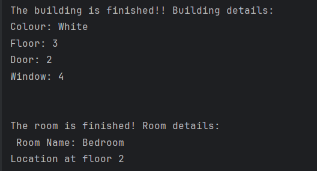

     
### **Enumeration**  
   *Enumeration* adalah *class* khusus pada Java yang berisi *variables* yang dikelompokkan menjadi satu. *Enumeration* dapat digunakan ketika memiliki kumpulan data yang sudah *fixed* dan ingin menyimpan kumpulan data tersebut ke sebuah tipe data baru. Misalnya seperti nama-nama hari, nama-nama bulan, nama-nama buah, dan lain-lain.   
   Contoh:  
   ```java
   enum fruit{  
       *APPLE*,  
       *ORANGE*,  
       *BANANA*,  
       *WATERMELON*  
   }  
   ```

   Terdapat beberapa keuntungan dari menggunakan *enumeration*, yaitu:  
1. Safety  
   *Enumeration* memberikan keamanan tambahan karena membatasi data dari set yang sudah ditetapkan. Pembatasan ini dapat mencegah munculnya kesalahan yang disebabkan oleh data yang tidak valid.   
2. Consistency  
   Penggunaan *enumeration* memberikan *consistency* tambahan pada program karena *enumeration* memastikan bahwa set data yang ditetapkan akan selalu konsisten di seluruh program.   
3. Readability  
   *Enumeration* juga membuat program menjadi lebih mudah untuk dibaca dan dipahami. Misalnya terdapat sebuah enum Month yang berisi 12 nama bulan, penggunaan Month.OCTOBER pada *code* akan lebih memudahkan kita untuk membaca program jika dibandingkan dengan menggunakan numerik seperti 10 untuk bulan October.   
     
### **Interface**  
    *Interface* adalah suatu mekanisme khusus yang digunakan untuk *abstraction*. Isi dari *interface* adalah *abstract* *method* dan *variable* yang bersifat *public*, *static*, dan *final*. *Interface* dapat digunakan oleh *class* dengan menggunakan “**implements**”. Agar lebih mudah dalam memahami *interface*, perhatikan gambar dan perumpamaan berikut:

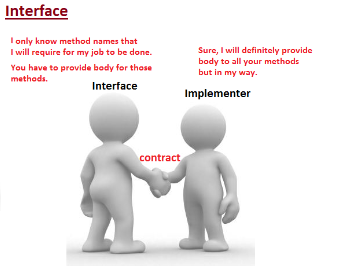  
Misalkan sebuah Perusahaan memberikan kontrak kerja kepada 3 karyawannya, yaitu seorang *chef*, seorang kasir, dan seorang *waiter*. Kontrak kerja tersebut hanya berisi perintah bagi para karyawan untuk bekerja, tetapi tidak dijelaskan secara rinci bagaimana para karyawan harus bekerja. Karena chef, kasir, dan waiter bekerja dengan cara yang berbeda, maka mereka mengimplementasikan maksud dari bekerja tersebut dengan cara mereka masing-masing.  
Dari contoh tersebut, kontrak kerja merupakan *interface*, isi dari kontrak kerja yang menyuruh karyawan untuk bekerja tanpa memberikan detailnya merupakan isi dari *interface* (*abstract* *method*), dan 3 karyawan (*chef*, kasir, dan *waiter*) adalah *class* yang mengimplementasikan *interface*. 

Secara sekilas, *interface* seperti memiliki fungsi yang mirip dengan *class*, terutama *abstract* *class* yang juga sama-sama memiliki *abstract* *method*. Tetapi, terdapat beberapa perbedaan penting antara *interface* dengan *abstract* *class:*

* *Abstract* *class* bisa memiliki *constructor* dan *method* biasa yang memiliki isi. Sedangkan interface hanya bisa berisi *abstract* *method*.  
* Jika *class* ingin menggunakan *abstract* *class*, menggunakan “**extends**”. Sedangkan jika *class* ingin menggunakan *interface*, menggunakan “**implements**”  
    
  Untuk lebih mudah memahami perbedaan *abstract* *class* dan *interface*, perhatikan contoh perumpamaan berikut:  
1. Interface  
   Masih menggunakan perumpamaan yang sama seperti di atas, berikut adalah contoh *code* untuk *interface* bernama Contract yang berisi *abstract* *method* bekerja(). *Method* bekerja() disebut *abstract* *method* karena *method* tersebut tidak memiliki *body*/isi.  
   ```java
   public interface Contract {  
       void bekerja();  
   }
   ```

   Berikut adalah contoh *code* *class* Company yang memiliki 3 *nested* *class*, yaitu *class* Chef, Kasir, dan Waiter. 3 nested class ini mengimplementasikan *interface* Contract.   

   ```java  
   public class Company {

       public static class Chef implements Contract{  
           @Override  
           public void bekerja() {  
               System.*out*.println("Chef bekerja dengan cara memasak");  
           }  
       }

       public static class Kasir implements Contract{  
           @Override  
           public void bekerja() {  
               System.*out*.println("Kasir bekerja dengan cara melayani pembayaran customer ");  
           }  
       }

       public static class Waiter implements Contract{  
           @Override  
           public void bekerja() {  
               System.*out*.println("Waiter bekerja dengan cara mengantarkan pesanan ke customer");  
           }  
       }

       public static void main (String args\[\]){  
           Contract chef \= new Chef();  
           Contract kasir \= new Kasir();  
           Contract waiter \= new Waiter();

           chef.bekerja();  
           kasir.bekerja();  
           waiter.bekerja();  
       }  
   }  
   ```

   Dapat dilihat bahwa setiap *nested* *class* menggunakan *method* bekerja() dengan cara mereka masing-masing. Misalnya seperti Chef bekerja dengan cara memasak dan Kasir bekerja dengan cara melayani pembayaran *customer*.   
     
   Output:  
   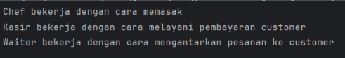

     
     
2. Abstract Class  
   Misalkan suatu organisasi terdiri dari 2 buah *staff*, yaitu bendahara dan sekretaris. Ketua dari organisasi tersebut memberikan 2 tugas kepada *staff*\-nya, yaitu untuk melapor pekerjaan mereka ke ketua organisasi dan bekerja. Tetapi ketua organisasi tidak menjelaskan pekerjaan yang harus dilakukan oleh para *staff*. 

   

   Dari perumpamaan di atas, ketua organisasi merupakan *abstract* *class* dan 2 tugas yang diberikan oleh ketua adalah isi dari *abstract* *class.* Tugas untuk melapor ke ketua merupakan method yang memiliki isi, sedangkan *method* *bekerja* merupakan *abstract* *method*. Sekretaris dan bendahara merupakan *class* yang menggunakan *abstract* *class*. 

   Berikut adalah *code* untuk *abstract* *class* bernama Organisasi:  
   ```java
   abstract public class Organisasi {  
       String jabatan, namaPengurus;

       Organisasi(String Jabatan, String NamaPengurus){  
           this.jabatan \= Jabatan;  
           this.namaPengurus \= NamaPengurus;  
       }

       void laporan(){  
           System.*out*.println(jabatan \+ " sudah melapor ke ketua organisasi");  
       }

       abstract void bekerja();

   }  
   ```
     
   Dan berikut adalah *code* untuk *class* bernama Staff yang memiliki 2 *nested* *class,* yaitu Sekretaris dan Bendahara.   
   ```java
   public class Staff {

       public static class Sekretaris extends Organisasi{

           Sekretaris(String namaPengurus){  
               super("Sekretaris", namaPengurus);  
           }  
           @Override  
           void bekerja() {  
            System.*out*.println("Sekretaris bertanggung jawab dalam surat menyurat");  
           }  
       }

       public static class Bendahara extends Organisasi{  
           Bendahara(String namaPengurus){  
               super("Bendahara", namaPengurus);  
           }  
           @Override  
           void bekerja() {  
               System.*out*.println("Bendahara bertanggung jawab dalam keuangan");  
           }  
       }

       public static void main (String args\[\]){  
           Organisasi sekretaris \= new Sekretaris("Caca");  
           Organisasi bendahara \= new Bendahara("Budi");

           sekretaris.laporan();  
           bendahara.laporan();

           System.*out*.println("\\n");  
           sekretaris.bekerja();  
           bendahara.bekerja();

       }  
   }
   ```

   Sama seperti *interface*, *abstract* *method* bekerja dijalankan sesuai dengan tugasnya masing-masing. Tetapi *nested* *class* ini juga menggunakan *constructor* milik *super* *class*, yaitu *abstract* *class* Organisasi. Lalu pada *method* *main*, *method* laporan pada *abstract* *class* juga digunakan oleh sekretaris dan bendahara. Penggunaan *constructor* dan *method* laporan inilah yang membedakan *interface* dan *abstract* *class*.   
     
   Output:  
   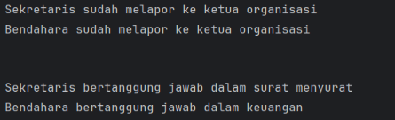
     
   Dari penjelasan di atas, berikut adalah beberapa kondisi kapan harus menggunakan *interface*  atau *abstract class*:  
* *Interface* digunakan jika **hanya ingin** menggunakan *abstract* *method* saja. Sebaliknya, *abstract method* digunakan jika ingin menggunakan *abstract method*, *constructor*, atau *method* lain yang sudah memiliki isi.   
* *Interface* digunakan jika **hubungan** **hierarki tidak dipedulikan** atau *class* manapun dapat menggunakan *interface*, tanpa memperdulikan apakah *class* tersebut berhubungan dengan *interface* atau tidak. *Abstract* *class* digunakan jika hubungan hirarki antar *class* diperhatikan dan tidak seluruh *class* dapat menggunakan *abstract* *class* tersebut.   
* *Abstract* *class* dapat digunakan untuk melakukan *reuse* *code*, misalnya seperti *method* laporan di atas. *Code* yang berada di *method* laporan tidak perlu ditulis ulang kembali setiap *object* dibuat, melainkan hanya perlu memanggil *method* laporan saja. Sedangkan di *interface*, *reuse* *code* seperti ini tidak bisa dilakukan.  
## **Git dan Github**  
* Git adalah *distributed* Version Control System (VCS) yang digunakan untuk melakukan *management* dan memantau pada program. Git dapat melakukan banyak hal, seperti membuat *repository* untuk me-*manage* *project*, melakukan *push* *local* ke *project*, melakukan *pull* dari *project* ke *local*, dan lain-lain. Kegunaan dari git ini dapat dilihat lebih lengkap pada *documentation* yang disediakan langsung oleh Git, yang bisa diakses dari link berikut [https://git-scm.com/docs](https://git-scm.com/docs). Berikut beberapa *comman*d Git yang sering digunakan:

| Command | Description |
| ----- | ----- |
| git init | Membuat Git repository baru.  |
| git clone | Menyimpan/download repository Git ke device local |
| git add | Menambahkan file baru atau perubahan ke area staging |
| git branch  | Menampilkan seluruh branch yang ada |
| git commit \-m “message” | Menambahkan message terkait perubahan yang ditambahkan |
| git pull | Melakukan fetch dari repository ke branch local. |
| git push | Meng-update commit dari repository local ke repository remote |
| git \--version | Untuk menampilkan version dari Git yang di-install |
| git remote add \[repository\_remote\] \[URL\_repository\_remote\] | Menambahkan repository remote ke repository Git local |


* Github  
  Github adalah *platform* Git yang digunakan untuk menyimpan dan melakukan *tracking* proses project yang dibuat. Github juga mengizinkan para *developer* atau *programmer* untuk saling berkolaborasi dalam membuat suatu project. Github bisa diakses melalui link berikut [https://github.com/](https://github.com/). Untuk menggunakan Github, diperlukan akun Github yang dapat didaftarkan menggunakan akun E-mail. Github juga mengizinkan pembuatan *repository* sebagai tempat untuk menyimpan project yang dibuat. 