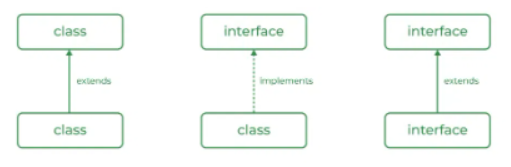

import AuthorList from "../../src/components/Author";

# MODUL 2: Inheritance and Access Modifier

<AuthorList authorsName={["emiw"]} />

## Class dan Object

**Class** secara dasarnya merupakan sebuah template/blueprint dari sebuah objek dan merepresentasikan tipe dari objek tersebut. **Object** dibuat dari class dan menyimpan state, behavior, dan identity yang membuat object tersebut unik.

Bayangkan kamu sedang berada di sebuah pabrik penghasil madu. Di pabrik ini, ada produk madu yang sudah jadi (Object), dan ada resep dari madu tersebut (Class). Class adalah "perencanaan" atau blueprint, sedangkan Object adalah implementasi dari "perencanaan" tersebut.

Sebuah class pada Java biasanya mengandung beberapa hal antara lain adalah:

1. Fields/Data Member
   Menyimpan data ataupun atribut dari suatu objek, dalam bentuk sebuah variabel. Ibaratkan seperti bahan-bahan yang dibutuhkan untuk membuat madu. Dalam class, ini dikenal sebagai atribut atau properti.
2. Method
   Mengandung implementasi dari fungsionalitas/behavior objek tersebut, biasanya dalam bentuk sebuah fungsi. Ibaratkan seperti mesin yang mengolah madu. Dalam class, ini dikenal sebagai metode atau fungsi, yang menjalankan tindakan atau proses tertentu.
3. Constructor
   Digunakan saat menginisialisasi objek baru, dan merupakan fungsi yang akan selalu dipanggil pertama ketika objek baru dibuat
4. Nested Class/Inner Class
   Sebuah class dapat mengandung class lain. Sesuai dengan access modifier-nya, class tersebut dapat disebut sebagai nested class jika static dan inner class jika non-static

```
access_modifier class <class_name>{
    data member;
   method;
   constructor;
   nested class;
}
```

Dalam Java, ada beberapa tipe class yang dapat digunakan, antara lain:

1. Regular
   Class biasa yang digunakan untuk mendefinisikan objek dengan atribut dan perilaku tertentu. Class ini tidak memiliki modifikasi khusus seperti static, final, atau abstract.
2. Static
   Static Class mengacu pada static nested class. Static nested class adalah class yang dideklarasikan di dalam class lain dan dapat diakses tanpa harus membuat instance dari class luar.
3. Final
   Final Class sesuai namanya “Final” dimana perilaku atau properti dari class tersebut tidak bisa diubah oleh class lain. Oleh karena itu, final class tidak bisa diwariskan atau di-subclass.
4. Abstract
   Class yang tidak dapat diinstansiasi dan mungkin mengandung metode abstrak (metode tanpa implementasi). Class lain harus mewarisi dan mengimplementasikan metode abstrak ini.

**Object** dibuat dari template yang didefinisikan oleh sebuah class dan sering dipanggil sebagai suatu “instance” (dari class yang digunakan). Untuk membuat sebuah objek dapat dipanggil constructor-nya, seperti contoh di bawah yang melakukan pembuatan beberapa objek tipe Madu dengan keunikannya masing-masing yang membuat setiap objek unik. Berikut contoh pembuatan class dan object:

```java
public class Madu {
    //Fields
    public int madu_kg; // madu dalam kg
    public int gula_kg; // gula dalam kg
    public int air_lt; // air dalam liter

    // Constructor
    public Madu(int banyak_madu, int banyak_gula, int banyak_air) {
        this.madu_kg = banyak_madu;
        this.gula_kg = banyak_gula;
        this.air_lt = banyak_air;
    }

    // Metode untuk menampilkan resep
    public void displayResep() {
        System.out.println("Resep Madu TJ:");
        System.out.println("Madu: " + madu_kg + " kg");
        System.out.println("Gula: " + gula_kg + " kg");
        System.out.println("Air: " + air_lt + " liter");
    }

    //Main
    public static void main(String[] args) {
        // Object
        Madu maduTJ = new Madu(5, 2, 3);
        maduTJ.displayResep();
    }
}
```

Pada kode diatas, Class terdapat method ‘main’. Dalam Java, class yang berisi metode ‘main’ adalah titik awal dari program Java dieksekusi. Keberadaan metode ‘main‘ sangat penting karena JVM (Java Virtual Machine) membutuhkan metode ini sebagai titik masuk untuk menjalankan aplikasi Java. Deklarasi standar metode ‘main’ meliputi:

- ‘public’ untuk aksesibilitas dari luar kelas.
- ‘static’ agar dapat dipanggil tanpa membuat instance kelas.
- ‘void’ yang menandakan metode ini tidak mengembalikan nilai.
- ‘String[] args’ untuk menerima argumen baris perintah.

## Interface

Interface pada Java merupakan sebuah kontrak atau kesepakatan yang mendefinisikan metode atau fungsi yang harus diimplementasikan oleh suatu kelas. Interface tidak mengandung implementasi logika dari metode-metode tersebut, melainkan hanya mendefinisikan apa saja metode yang harus ada.

Interface ini adalah blue print dari class. Method-method yang ada di dalam interface tersebut kosong dan nantinya harus diimplementasi pada class lain. Misalnya, terdapat sebuah blue print yang menggambarkan laptop. Setiap laptop harus memiliki beberapa fitur dasar seperti layar, keyboard, dan baterai, namun cara setiap laptop tersebut mengimplementasikan fitur-fitur tersebut bisa berbeda. Interface dalam hal ini bisa dianggap sebagai panduan umum yang menentukan bahwa setiap laptop harus memiliki fungsi-fungsi tertentu seperti menyala, mati, mengisi daya, dan sebagainya.

```java
public interface Laptop {
       void powerOn();
       void powerOff();
       void chargeBattery();
   }

   public class Applesus implements Laptop {
       @Override
       public void powerOn() {
           System.out.println("Applesus is powering on");
       }

       @Override
       public void powerOff() {
           System.out.println("Applesus is shutting down");
       }

       @Override
       public void chargeBattery() {
           System.out.println("Applesus is charging with a fast charger.");
       }
   }
```

Apa bedanya Interface dengan Class?  
 
Interface digunakan ketika:

1. Mendefinisikan suatu “blue print” untuk Class tanpa menentukan implementasi method-method.
2. Penerapan polymorphism untuk Class yang memiliki method yang sama namun implementasi yang berbeda.

## Enumeration

Enumeration pada Java digunakan untuk merepresentasikan suatu set/group dengan konstan yang memiliki nama. Enumeration ini sebaiknya diimplementasikan ketika kita memiliki sekumpulan nilai yang tetap dan tidak akan berubah sepanjang eksekusi program.

Contoh penggunaan enumeration adalah untuk merepresentasikan bulan-bulan dalam Java. Dikarenakan bulan-bulan seperti January sampai December merupakan nilainya konstan dan tidak akan berubah maka dapat menggunakan enumeration.

```java
public enum Month{
       JANUARY, FEBRUARY, MARCH, APRIL, MAY, JUNE, JULY, AUGUST, SEPTEMBER, OCTOBER, NOVEMBER, DECEMBER
   }

   Enumeration dapat dideklarasikan di dalam kelas ataupun di luar kelas.
   class Test {
       enum Month{
           JANUARY, FEBRUARY, MARCH, APRIL, MAY, JUNE, JULY, AUGUST, SEPTEMBER, OCTOBER, NOVEMBER, DECEMBER
       }

       public static void main(String\[\] args) {
           Month month \= Month.JANUARY;
           System.out.println(month);
           // Output yang dihasilkan adalah JANUARY
       }
   }

   public enum Month{
       JANUARY, FEBRUARY, MARCH, APRIL, MAY, JUNE, JULY, AUGUST, SEPTEMBER, OCTOBER, NOVEMBER, DECEMBER
   }

   public class Test {
       public static void main(String\[\] args) {
           Month month \= Month.JANUARY;
           System.out.println(month);
           // Output yang dihasilkan adalah JANUARY
       }
   }
```

Enumerasi digunakan karena beberapa alasan berikut:

1. Konsistensi: Enum memastikan bahwa hanya nilai-nilai yang sudah dideklarasikan dalam enum yang valid untuk digunakan, sehingga mengurangi error.
2. Numerikal: Nilai enum secara internal direpresentasikan sebagai angka, sehingga operasi komparasi dan penyimpanan lebih efisien.

## Encapsulation

Enkapsulasi merupakan **salah satu konsep utama OOP** yang membungkus fields dan methods dalam sebuah unit yang disebut class. Konsep ini mendukung prinsip data hiding, yang menghalangi akses langsung ke fields dan methods dari kode eksternal. Dalam konsep enkapsulasi, implementasi dari sebuah class disembunyikan dari luar dan hanya menunjukkan interface untuk berinteraksi dan mengakses fungsionalitas/data dari class tersebut.

Dalam Java, sebuah variabel dapat dibuat menjadi private untuk memblokir akses langsung dari luar class dan hanya membuka akses dari dalam kelas tersebut. Sehingga, untuk mengakses data tersebut dari luar kelas, digunakan sesuatu dengan istilah getter dan setter (ataupun accessors dan mutators). Sesuai dengan namanya, getter merupakan sebuah fungsi yang akan mengambil (get) data dari variabel yang diinginkan, dan setter berfungsi untuk menyimpan nilai baru di variabel tersebut.

```java
class Laptop {
       //fields
       private String type;
       // ...

       //constructor
       public Laptop(String type) {
           this.type \= type;
       }

       //getter
       public String getType() {
           return type;
       }

       //setter
       public void setType(String type) {
           this.type \= type;
       }
   }
```

Dapat dilihat di atas agar type tidak dapat diakses secara langsung dari luar, maka kita ubah variabelnya menjadi private. Kemudian membuat fungsi getter-setter agar variabel tersebut dapat diakses dari luar menggunakan fungsi.

Penggunaan setelah konsep enkapsulasi:

```java
public class Main {
    public static void main(String\[\] args) {
        Laptop myLaptop \= new Laptop("Notebook, Gaming, Hybrid");
        myLaptop.setType("Hybrid");
        System.out.println(myLaptop.getType());
    }
}
```
