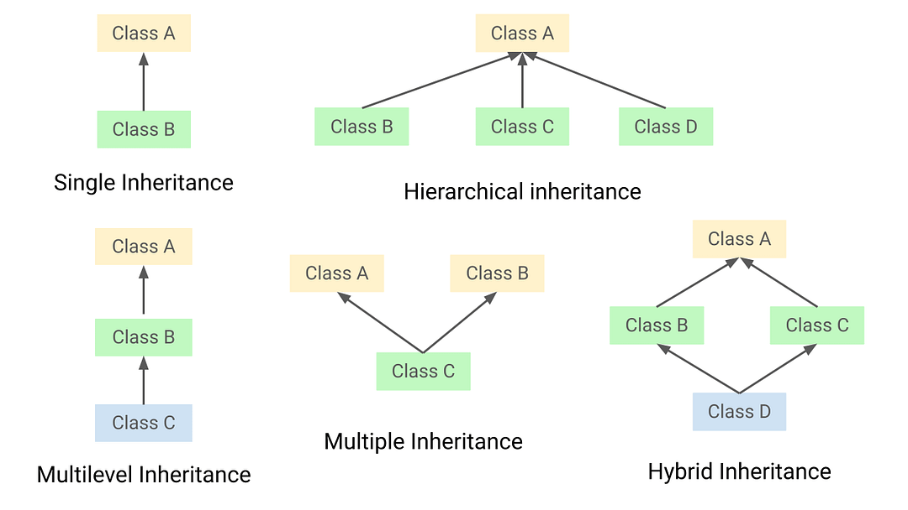

import AuthorList from "../../src/components/Author";
import TypeInheritance from "./assets/modul2/tipe-inheritance.png";

# MODUL 2: Inheritance and Access Modifier

<AuthorList authorsName={["emiw"]} />

## Inheritance

### Pengertian

Inheritance adalah salah satu dari empat konsep dalam Object-Oriented Programming (OOP) yang memungkinkan sebuah class mewarisi properti dan method dari class lain.

Terminologi yang umum dalam konsep inheritance yaitu

- Class, sebuah kumpulan object yang memiliki properti yang sama. Sering dianggap sebagai template atau blueprint terhadap object
- Subclass atau Child class, class yang mewarisi property dan method dari class lain.
- Super Class atau Parent Class, class dimana subclass membawa sifat turunannya.

Dengan inheritance, subclass dapat menggunakan atau bahkan mengoverride properti dan method yang ada di superclass, sehingga meminimalkan redundansi kode dan meningkatkan keteraturan.

Sebagai contoh, jika kita memiliki superclass Agent dengan properti bahwa suatu agent pasti memiliki skill dan suara yang masing-masing, subclass seperti Astra dan Brimstone bisa mewarisi properti dan method tersebut, serta menambahkan atau mengubahnya sesuai kebutuhan dari subclass tersebut. Keyword 'super; digunakan dalam konstruktor subclass untuk memanggil konstruktor dari superclass. Pemanggilan 'super' ini biasanya dilakukan di baris pertama konstruktor subclass untuk memastikan bahwa bagian dari objek yang diturunkan dari superclass sudah diinisialisasi dengan benar.

### Tipe-tipe Inheritance:

1. Single Inheritance

   Sebuah subclass hanya mewarisi dari satu superclass. Contohnya, 'Astra' yang mewarisi dari 'Agent'.

2. Multiple Inheritance

   Sebuah subclass mewarisi properti dan method dari lebih dari satu superclass. Di Java, multiple inheritance di level class tidak didukung secara langsung, tetapi dapat diimplementasikan melalui penggunaan interfaces.

3. Multilevel Inheritance

   Sebuah subclass mewarisi dari superclass yang juga merupakan subclass dari class lain. Misalnya, 'ChamberOmega' mewarisi dari 'Chamber' yang juga mewarisi dari 'Agent'.

4. Hierarchical Inheritance

   Satu superclass diwarisi oleh lebih dari satu subclass. Misalnya, 'Astra' dan 'Brimstone' keduanya mewarisi dari 'Agent'.

5. Hybrid Inheritance

   Kombinasi dari satu atau lebih tipe inheritance lainnya. Sebagian besar, ini adalah situasi dari single dan multiple inheritance. Di Java, hybrid inheritance juga tidak mungkin dilakukan dengan kelas, tetapi dapat dicapai melalui Interfaces.



### Syntax dalam Java Inheritance

1. Class

   ```java
   class Subclass extends Superclass { ... }
   ```

2. Interface

   ```java
   class Subclass implements OtherInterface { ... }
   ```

3. Kombinasi
   ```java
   class Subclass extends Superclass implements OtherInterface, ... { ... }
   ```

### Contoh program inheritance dalam java

```java
class Animal {
	void eat() { System.out.println("eating..."); }
}

class Dog extends Animal {
	void bark() { System.out.println("barking..."); }
}

class TestInheritance {
	public static void main(String args[]) {
		Dog d=new Dog();
		d.bark();
		d.eat();
	}
}
```

### Kenapa Perlu Inheritance?

1. Reusabilitas kode

   Dengan inheritance, kode yang sudah ada dapat digunakan kembali tanpa perlu menulis ulang. Ini mengurangi redundansi dan mempermudah pemeliharaan kode.

2. Kemampuan abstraksi method overriding

   Inheritance memungkinkan objek dari subclass yang berbeda diperlakukan sebagai objek dari superclass yang sama. Ini sangat berguna dalam konteks polimorfisme, di mana metode yang sama dapat memiliki implementasi yang berbeda tergantung pada jenis objeknya.

### Konsep Upcasting dan Downcasting

Sebuah proses untuk mengkonversi sebuah tipe data disebut sebagai Typecasting. Dalam konsep inheritance, tumbuh sebuah konversi yang umum disebut sebagai Upcasting dan Downcasting. Pada java, kita diperbolehkan melakukan typecasting dari primitive type wrapper (Integer, Double, dll) kepada tipe data primitif atau sebaliknya. Diluar dari fitur tersebut, object hanya boleh di typecast terhadap jenis objek lain saja.

a. Upcasting

    Upcasting adalah jenis type casting objek dimana objek child diketik ke objek kelas parent. Dengan menggunakan Upcasting, kita dapat dengan mudah mengakses variabel dan metode dari kelas parent ke kelas child. Upcasting juga dikenal sebagai Generalisasi.

b. Downcasting

    Dalam Downcasting, objek referensi kelas induk direferensikan sebagai kelas anak. Perilaku downcasting harus dilakukan secara hati-hati karena tidak menghasilkan compile-time error. Jika casting tidak sesuai dengan objek pembentuknya, ketika dijalankan akan melempar "ClassCastException". Kenapa jika berbahaya downcasting diizinkan oleh kompiler? Di Java, beberapa skenario perilaku downcasting dapat bermanfaat.

Jika terjadi kondisi overriding, maka method yang akan dipanggil sesuai dengan objek saat instansiasi. Contoh:

```java
public class Parent {
public String foo() { return "parent"; } }
public class Child extends Parent {
public String foo() { return "child"; } }
```

Upcasting:

```java
Parent a = new Child();
System.out.println(a.foo()); // output: child
```

Downcasting:

```java
Parent a = new Child();
Child b = (Child) a;
System.out.println("a: " + a.foo()); // output: child
System.out.println("b: " + b.foo()); // output: child
```

## Access Modifier

Access modifier merupakan sebuah hak akses yang diberikan kepada sebuha variable, method atau class tujuan untuk menjaga integritas dari data tersebut ketika ingin diakses object lain.

### Tipe-tipe Access Modifier di Java

1. Default

   Ketika access modifier tidak ditentukan maka akan secara otomatis memiliki access modifier 'Default'. Anggota data, kelas, atau metode yang tidak dinyatakan menggunakan pengubah akses apa pun yaitu memiliki pengubah akses default dapat diakses hanya dalam paket yang sama.

2. Private

   Metode atau anggota data yang dinyatakan sebagai 'Private' hanya dapat diakses di dalam kelas di mana mereka dinyatakan. Hal ini digunakan untuk menjaga agar variabel atau method tidak dapat diakses dari luar kelas, yang membantu melindungi integritas data.

3. Protected

   Metode atau anggota data yang dinyatakan sebagai 'Protected' dapat diakses dari dalam kelas itu sendiri, subclass, dan kelas lain yang berada dalam paket yang sama. Ini memberikan keseimbangan antara keterbukaan dan perlindungan data.

4. Public

   Metode atau anggota data yang dinyatakan sebagai 'Public' dapat diakses dari mana saja, baik dari dalam kelas, subclass, atau kelas lainnya. Ini memungkinkan interaksi yang luas dengan anggota kelas tersebut.

5. Final

   Metode atau anggota data yang dinyatakan sebagai 'Final' maka nilai variable tersebut bersifat final dan tidak dapat diubah. Hal ini digunakan untuk mencegah perubahan lebih lanjut. Jika diterapkan pada method, method tersebut tidak dapat dioverride oleh subclass. Jika diterapkan pada kelas, kelas tersebut tidak dapat diwariskan.
